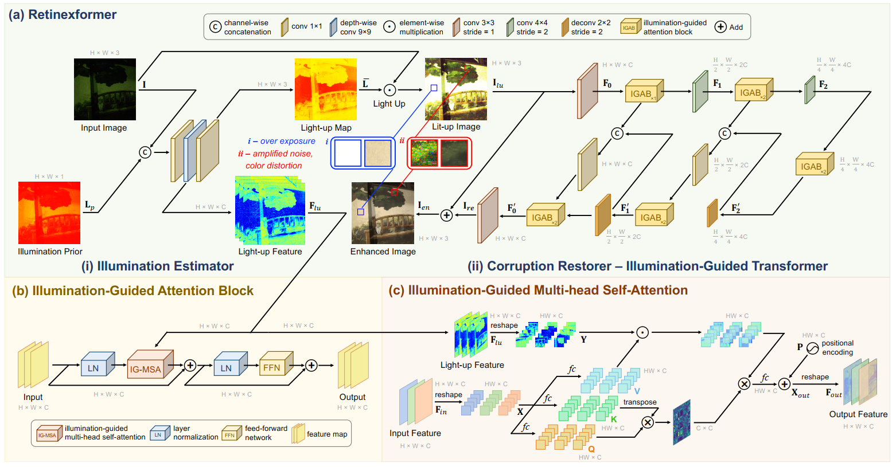
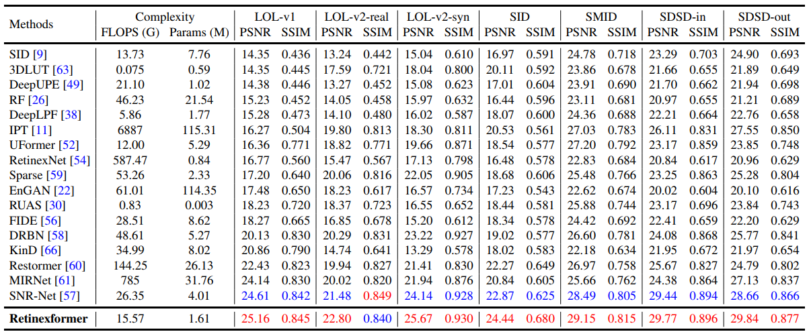
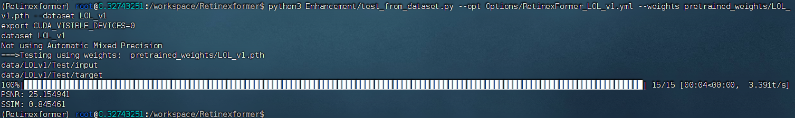
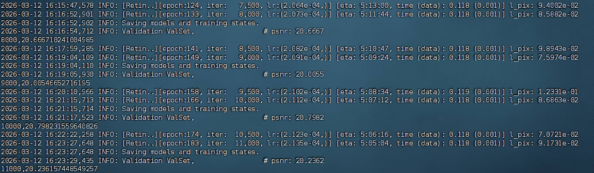

[原仓库](https://github.com/caiyuanhao1998/Retinexformer?tab=readme-ov-file)


# 原论文






# 配置环境

原项目：

- 显卡要求：本项目使用PyTorch 1.11 + cu113，最多使用30系显卡，我使用5060ti报错

```shell
conda create -n Retinexformer python=3.7 -y
conda activate Retinexformer

conda install pytorch=1.11 torchvision cudatoolkit=11.3 -c pytorch -y
# 这一步可能报错
# Retinexformer) root@C.32741530:/workspace$ python -c "import torch; print(torch.__version__); print(torch.cuda.is_available()); print(torch.version.cuda)" Traceback (most recent call last): File "<string>", line 1, in <module> File "/venv/Retinexformer/lib/python3.7/site-packages/torch/__init__.py", line 199, in <module> from torch._C import * # noqa: F403 ImportError: /venv/Retinexformer/lib/python3.7/site-packages/torch/lib/libtorch_cpu.so: undefined symbol: iJIT_NotifyEvent
# 如果报错则安装 conda install "mkl=2024.0" -y
python -c "import torch; print(torch.__version__); print(torch.cuda.is_available()); print(torch.version.cuda)"

pip install matplotlib scikit-learn scikit-image opencv-python yacs joblib natsort h5py tqdm tensorboard
pip install einops gdown addict future lmdb numpy pyyaml requests scipy yapf lpips thop
# 如果lmdb报错，是版本问题
python -c "import lmdb; print(lmdb.__version__)"
pip uninstall -y lmdb
pip install --no-cache-dir "lmdb==1.4.1"
```

安装BasicSR

```shell
git clone https://github.com/jaxhur/Retinexformer.git

cd /workspace/Retinexformer
python setup.py develop --no_cuda_ext
```


# 数据集

- [LOL-v1](https://drive.google.com/file/d/1L-kqSQyrmMueBh_ziWoPFhfsAh50h20H/view?usp=sharing)
- [LOL-v2](https://drive.google.com/file/d/1Ou9EljYZW8o5dbDCf9R34FS8Pd8kEp2U/view?usp=sharing)

Linux：

```
# 0) 在项目根目录
cd /workspace/Retinexformer

# 1) 安装解压工具
sudo apt-get install -y unzip p7zip-full


# 2) 建目录
mkdir -p data/SMID data/SDSD data/LOLv1 data/LOLv2 data/SID data/FiveK
# 下载数据
# LOL-v1 (单文件)
gdown --fuzzy "https://drive.google.com/file/d/1L-kqSQyrmMueBh_ziWoPFhfsAh50h20H/view?usp=sharing" -O data/LOLv1/LOLv1.zip

# LOL-v2 (单文件)
gdown --fuzzy "https://drive.google.com/file/d/1Ou9EljYZW8o5dbDCf9R34FS8Pd8kEp2U/view?usp=sharing" -O data/LOLv2/LOLv2.zip

# SID (文件夹)
gdown --folder "https://drive.google.com/drive/folders/1eQ-5Z303sbASEvsgCBSDbhijzLTWQJtR?usp=share_link&pli=1" -O data/SID

# SMID (文件夹，含分卷压缩)
gdown --folder "https://drive.google.com/drive/folders/1OV4XgVhipsRqjbp8SYr-4Rpk3mPwvdvG" -O data/SMID

# SDSD-indoor/outdoor (同一个文件夹，含分卷压缩)
gdown --folder "https://drive.google.com/drive/folders/14TF0f9YQwZEntry06M93AMd70WH00Mg6" -O data/SDSD

# FiveK (单文件)
gdown --fuzzy "https://drive.google.com/file/d/11HEUmchFXyepI4v3dhjnDnmhW_DgwfRR/view?usp=sharing" -O data/FiveK/FiveK.zip

# README要求的 text_list.txt
mkdir -p data/SMID/SMID_Long_np
gdown --fuzzy "https://drive.google.com/file/d/199qrfizUeZfgq3qVjrM74mZ_nlacgwiP/view?usp=sharing" -O data/SMID/SMID_Long_np/text_list.txt


# 分卷解压
cd /workspace/Retinexformer/data/LOLv1
unzip -o LOLv1.zip
mv /workspace/Retinexformer/data/LOLv1/LOLv1/* /workspace/Retinexformer/data/LOLv1/


cd data/SMID
unzip -o smid.zip
```

目录结构：


```

```


# 预训练权重进行测试

- 下载在不同训练集上的[模型权重](https://drive.google.com/drive/folders/1ynK5hfQachzc8y96ZumhkPPDXzHJwaQV?usp=drive_link)，放到`./pretrained_weights`

  ```
  # linux
  cd /workspace/Retinexformer
  # 下载
  gdown --folder "https://drive.google.com/drive/folders/1ynK5hfQachzc8y96ZumhkPPDXzHJwaQV?usp=drive_link" -O pretrained_weights
  # 查看
  ls pretrained_weights
  ```

- Self-ensemble策略：使得结果更好，只需要加上`--self_ensemble`

测试命令

```shell
# activate the environment
conda activate Retinexformer

# LOL-v1
python3 Enhancement/test_from_dataset.py --opt Options/RetinexFormer_LOL_v1.yml --weights experiments/RetinexFormer_LOL_v1/models/best_G.pth --dataset LOL-v1

# LOL-v2-real
python3 Enhancement/test_from_dataset.py --opt Options/RetinexFormer_LOL_v2_real.yml --weights experiments/RetinexFormer_LOL_v2_real/models/best_G.pth --dataset LOL-v2-real

# LOL-v2-synthetic
python3 Enhancement/test_from_dataset.py --opt Options/RetinexFormer_LOL_v2_synthetic.yml --weights experiments/RetinexFormer_LOL_v2_synthetic/models/best_G.pth --dataset LOL-v2-syn

```




## 注意：不使用GT

LLFlow、KinD、最近一些 diffusion 模型 相同的测试设置：使用ground truth的均值增强模型输出``--GT_mean` `

- 不推荐使用，不够公平、真实应用场景的测试通常拿不到 ground truth

```shell
# LOL-v1
python3 Enhancement/test_from_dataset.py --opt Options/RetinexFormer_LOL_v1.yml --weights pretrained_weights/LOL_v1.pth --dataset LOL_v1 --GT_mean

# LOL-v2-real
python3 Enhancement/test_from_dataset.py --opt Options/RetinexFormer_LOL_v2_real.yml --weights pretrained_weights/LOL_v2_real.pth --dataset LOL_v2_real --GT_mean

# LOL-v2-synthetic
python3 Enhancement/test_from_dataset.py --opt Options/RetinexFormer_LOL_v2_synthetic.yml --weights pretrained_weights/LOL_v2_synthetic.pth --dataset LOL_v2_synthetic --GT_mean
```

`Enhancement/utils.py` 提供了`my_summary()` 用于**统计模型的参数量（Params）和计算复杂度（FLOPs）**

```shell
from utils import my_summary
my_summary(RetinexFormer(), 256, 256, 3, 1)
```


&nbsp;

# 训练


```shell
# activate the enviroment
conda activate Retinexformer

# LOL-v1
python3 basicsr/train.py --opt Options/RetinexFormer_LOL_v1.yml

# LOL-v2-real
python3 basicsr/train.py --opt Options/RetinexFormer_LOL_v2_real.yml

# LOL-v2-synthetic
python3 basicsr/train.py --opt Options/RetinexFormer_LOL_v2_synthetic.yml
```





# LOLv1


# LOLv2-real


# LOLv2-syn


